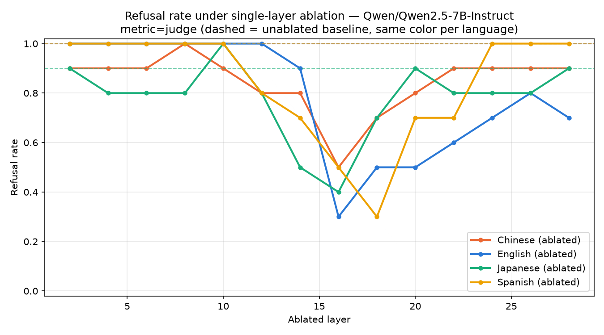

# cipher-jailbreaks
This project aims to understand how cipher-based jailbreak attacks bypass model refusal mechanisms. It initially studies small models (Qwen2.5-7b-it), hoping to find behaviors that generalize to more powerful models, while addressing two secondary goals of a public personal project:
- save compute budget, and
- avoid jailbreaking large models that could actually cause damage.

There are two main sections of the experiment.
- probe_generalization: reproduces the PolyRefuse paper, finding a refusal direction that generalizes across many natural languages by ablating layers.
- refusal_gap: the cipher branch of the project. Tests models' ability to decode ciphers and measures baseline refusal/compliance rate across ciphers. Analyze the cipher's effect on the multilingual refusal direction.

## Structure
The experimental pipeline consists of several standalone Python scripts. Raw model responses and judged scores are written to output .jsonl files, then summary tables and figures are derived from them.
- Raw data for languages should be stored in probe_generalization, ciphers in refusal_gap.

## Current findings
On Qwen2.5-7b.
- Replication of the PolyRefuse paper. Probes at all layers decode harmfulness of prompts, but only middle layers (esp. layer 16) are causally relevant.
- Partially successful jailbreak on the tiny model using letter-spaced text.
- Ablation on multilingual refusal direction also appears effective in letter-spaced format (need better metrics to quantify this).
- The model seems to frequently echo the prompt instead of refusing or complying.